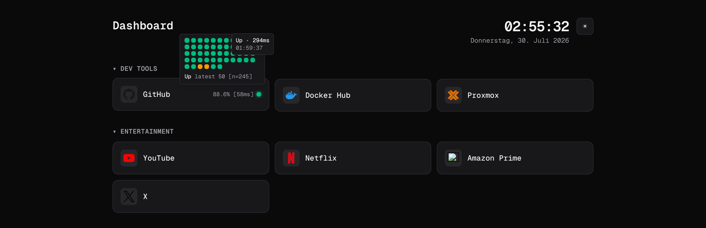

# link-page

A self-hosted link dashboard for your homelab, configured entirely through a single YAML file. Groups your bookmarks into cards and optionally monitors them, showing uptime and latency for the services you care about.



*The `modern` style in dark mode. Hovering a monitored link shows its heartbeat history, latency, and 24h uptime.*

## Features

- **YAML-driven** — no database, no admin UI. Edit `config.yaml` and reload the page.
- **Uptime monitoring** — opt-in per link. Tracks status, latency, and 24h uptime with a heartbeat bar.
- **Four card styles** — `modern`, `minimal`, `glass`, `terminal`.
- **Collapsible groups** that remember their state.
- **Auto icons** — falls back to the site's favicon when you don't specify one.
- **Multi-arch images** for `linux/amd64` and `linux/arm64`.

## Quick start

With Docker Compose:

```yaml
services:
  link-page:
    image: ghcr.io/codemarco05/link-page:latest
    container_name: link-page
    restart: unless-stopped
    ports:
      - "3000:3000"
    environment:
      CONFIG_PATH: /config/config.yaml
      DATA_DIR: /data
      TZ: Europe/Berlin
    volumes:
      - ./config.yaml:/config/config.yaml:ro
      - ./data:/data
```

Create a `config.yaml` next to it (see below), then:

```bash
docker compose up -d
```

The dashboard is at http://localhost:3000.

Editing `config.yaml` on the host takes effect on the next page load — no restart or rebuild needed. The page is rendered per request, so the mounted file is always read fresh.

## Configuration

```yaml
title: Dashboard
style: modern
theme: dark
columns: 3
linkTarget: current
checkIntervalSeconds: 60

groups:
  - name: Dev Tools
    items:
      - name: GitHub
        url: https://github.com
        icon: https://cdn.simpleicons.org/github
        type: page-monitored
        okStatus: [200, 301]
        degradedLatencyMs: 500
      - name: Docker Hub
        url: https://hub.docker.com
        icon: https://cdn.simpleicons.org/docker

  - name: Entertainment
    items:
      - name: YouTube
        url: https://youtube.com
        icon: https://cdn.simpleicons.org/youtube
```

### Top level

| Key | Type | Default | Description |
| --- | --- | --- | --- |
| `title` | string | `Dashboard` | Heading shown at the top of the page. |
| `style` | `modern` \| `minimal` \| `glass` \| `terminal` | `modern` | Card appearance. |
| `theme` | `dark` \| `light` \| `auto` | `dark` | Initial theme. See the note below — only `dark` is currently usable. |
| `columns` | int 1–8 | `3` | Cards per row on wide screens. |
| `linkTarget` | `current` \| `new-tab` | `current` | Where links open. |
| `checkIntervalSeconds` | int ≥ 5 | `60` | Default poll interval for monitored items. |
| `groups` | list | `[]` | Link groups (see below). |

> **Only the dark theme is finished.** `light` and `auto` are accepted by the
> config and the toggle is wired up, but the light palette is still unpolished.
> Stick with `theme: dark` for now.

### Groups and items

Each group has a `name` and a list of `items`. Item options:

| Key | Type | Default | Description |
| --- | --- | --- | --- |
| `name` | string | *required* | Link label. |
| `url` | URL | *required* | Link destination, also the monitored target. |
| `icon` | URL | site favicon | Icon image. Omit to auto-resolve from the domain. |
| `type` | `page` \| `page-monitored` | `page` | Use `page-monitored` to enable status checks. |
| `okStatus` | int list | `[200]` | HTTP codes treated as healthy. |
| `checkIntervalSeconds` | int ≥ 5 | inherits top level | Per-item poll interval. |
| `degradedLatencyMs` | int ≥ 1 | `500` | Responses slower than this count as degraded. |

### How monitoring works

Only items with `type: page-monitored` are polled. Each check is a `GET` with a 5 second timeout, and the result is one of:

- **up** — status is in `okStatus` and latency is at or below `degradedLatencyMs`.
- **degraded** — unexpected status code, or a response slower than `degradedLatencyMs`.
- **down** — timeout, DNS failure, connection refused, or any other request error.

Samples are kept for 24 hours and the heartbeat bar shows the most recent 50. The uptime percentage is calculated over the full 24 hour window. Checks run server-side from the container, so the dashboard can monitor services that aren't reachable from your browser.

Note that monitoring makes real outbound requests on an interval. Pointing it at third-party sites means polling someone else's servers, so keep intervals reasonable.

## Environment variables

| Variable | Default | Description |
| --- | --- | --- |
| `CONFIG_PATH` | `/config/config.yaml` | Path to the YAML config. Relative paths resolve from the working directory. |
| `DATA_DIR` | `/data` | Where monitor history is persisted as JSON. |
| `PORT` | `3000` | Port the server listens on. |
| `HOSTNAME` | `0.0.0.0` | Bind address. |
| `TZ` | unset | Timezone for the clock, e.g. `Europe/Berlin`. |

Mount `DATA_DIR` on a volume if you want uptime history to survive container restarts. Without it, history resets on every start.

## Container images

Published to GitHub Container Registry on every `v*` tag:

```
ghcr.io/codemarco05/link-page:latest
ghcr.io/codemarco05/link-page:0.1.2
ghcr.io/codemarco05/link-page:0.1
ghcr.io/codemarco05/link-page:0
```

Both `linux/amd64` and `linux/arm64` are included in the manifest, so the same tag works on x86 servers and ARM boards like a Raspberry Pi. Pre-release tags such as `v1.0.0-rc.1` get their version tags but are excluded from `latest`.

## Development

Requires Node.js and pnpm (the version is pinned via `packageManager` in `package.json`).

```bash
pnpm install
pnpm dev
```

Then open http://localhost:3000. In development, `config.yaml` is read from the project root unless `CONFIG_PATH` says otherwise.

```bash
pnpm build   # production build
pnpm start   # serve the production build
pnpm lint
```

### Building the image locally

```bash
docker compose up -d --build
```

The Dockerfile uses Next.js `output: "standalone"` in a multi-stage build and runs as a non-root user. To use a different host port:

```bash
PORT=8080 docker compose up -d
```

### Changing the favicon

Replace `app/favicon.ico`. It's a build-time asset, so the image needs rebuilding — unlike `config.yaml`, swapping it won't affect a running container.

## License

[MIT](LICENSE)
